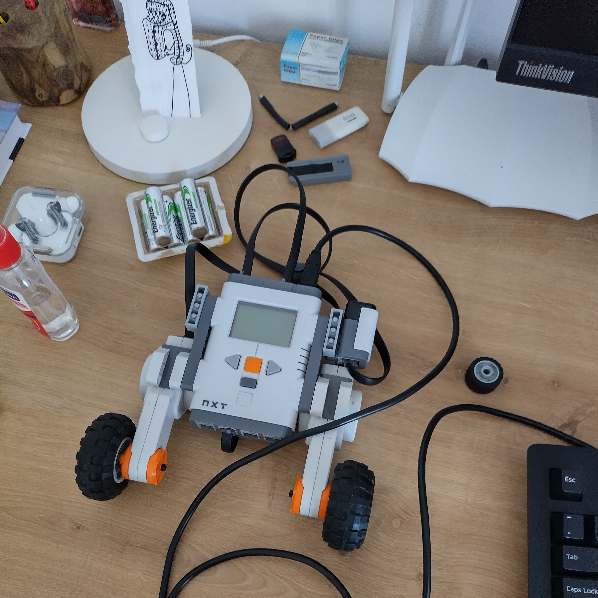

# Custom self-balancing robot

Using a LEGO Mindstorms NXT kit, this project aims to make a two-wheeled self-balancing robot.

The balancing controller is injected in a small custom firmware, tailor-made just for this project.

---

## Dependencies

To build the project in a linux x86 environment, the following dependencies are needed:

* `make` for building the project.
* The 32-bit version of the USB library (needed by the flashing utilities).
* `clang-format` (optional, to format all `C` code in the repository).

## Building process

* Build the actual hardware somewhat like the picture above. It's important that the gyro is sturdy and oriented like the picture, since it senses angular velocity for only one axes. If the end result differs from the picture, some of the balancing algorithm's parameters will probably need tweaking - more in the **configuration** section later.

* `make` to build the project.
* `make download` to build the project and flash the firmware onto the LEGO brick.
* `make clean` to clean all files generated by the building process.
* `make format` to format all `C` code in the repository.

## Running

Let's run down what each button does:

* The orange button in the middle is the *enter* button.
  It's used to power on the robot, and also start and stop the balancing act.
* The dark gray button below the *enter* button is the *exit* button.
  It's only purpose is to power down our robot.
* The *left arrow* button is used to put our brick in flashing mode.
  After pressing it, the only thing we can do is flash a new firmware, so be careful with it.
  If for any reason you are not able to reboot the brick to flashing mode using the *left arrow* button, there is a hardware button at the back of the brick that does the same thing if you press it long enough.
* The *right arrow* is used to calibrate our gyro sensor.

After flashing our firmware, and before starting the balancing act, we need to calibrate our gyro sensor. To do that, leave the brick down, press the *right arrow* button, and wait a bit until you see the gyro reading on the screen being stable. For a good calibration, it's important that the brick is not moving during this process. After a stable gyro reading is reached, press the right button once again. We are now ready to start the balancing act! Hold the robot in a vertical position[^1], press the *enter* button and observe our little robot struggling not to fall!

[^1]: The robot will try to balance based on that position, so try to be as much parallel to our gravitational pull as possible.

## Configuration

If the balancing act is does not last for more than three seconds, you will probably need to tweak some parameters in our [PID](https://en.wikipedia.org/wiki/PID_controller) controller implementation. It's important to note that, due to lack of precision in the gyro sensor, a successful run is considered one where the robot stands for about 5-10 seconds on its own. You can try tweaking the following 5 parameters in file `src/pid.c`:

* `MOTOR_OFFSET` is used to dictate the lower bound of power given to our two motors. Here the power is a percentage, and hence `MOTOR_OFFSET = 30` means that our motors will always run with either 0% power, or >30% power. That offset might be useful, since until ~40% power, our motors don't move at all.
* `Kp` is a constant representing the proportional part of the PID controller. This constant dictates how much a simple angle change will impact our output to the motors.
* `Ki` is a constant representing the integral part of the PID controller. This part looks at our past, and if it sees a bias towards one angle direction, it tries to compensate.
* `Kd` is a constant representing the derivative part of the PID controller. It's responsible for angular acceleration changes. Without it, the system is very unstable since it can't comprehend momentum, resulting in constant target angle overshooting.
* The `scale` variable is used in the integration part of the PID controller. You should change it only if tweaking the `Ki` constant has no effect.

## Attributions

* The flashing utilities present in the repository were written by **[David Anderson](mailto:david.anderson@calixo.net)**.

## Authors

* Drosakis Drosakis
* Dimitris Aspetakis
